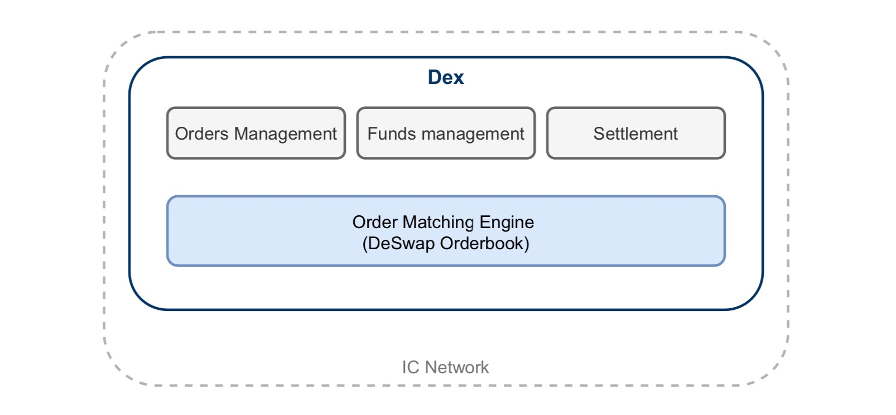
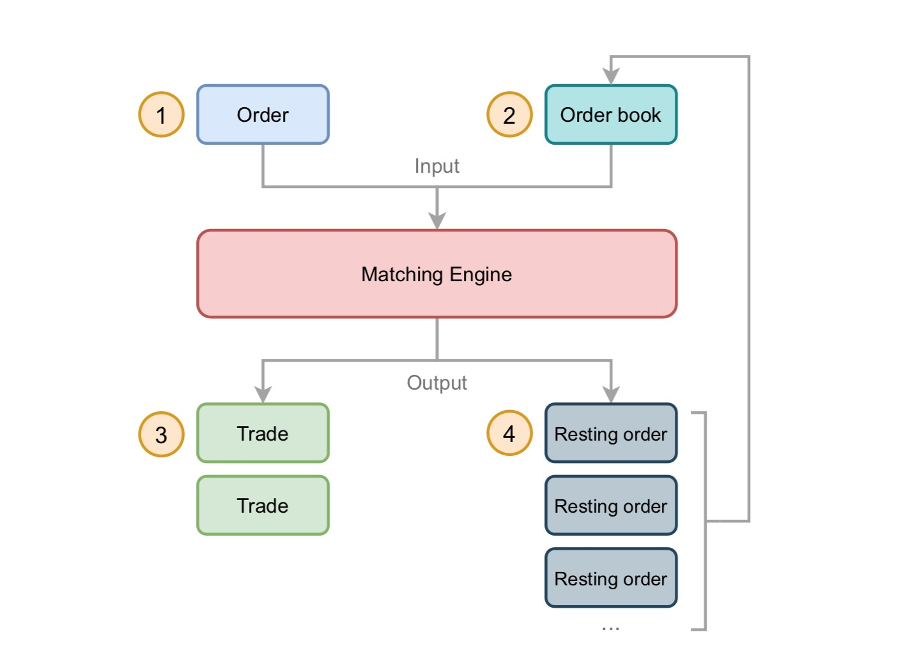

# DeSwap Orderbook

An Order Matching Engine Module for Dex in Motoko.

## Introduction

DeSwap Orderbook is an order matching engine module for the development of Dex, in Motoko language. 



To develop orderbook Dex on IC, an order matching engine is necessary for order management and order matching. The Matching Engine takes orders as an input, matches them and produces trades as an output. DeSwap Orderbook implements a price-time priority matching algorithm (FIFO): orders are first ranked according to their price; orders of the same price are then ranked depending on when they were entered. 

DeSwap Orderbook supports various order types like limit orders (LMT), market orders (MKT), Fill-And-Kill orders (FAK), Fill-Or-Kill orders (FOK).

DeSwap Orderbook module is the core of Dex, it is reusable and lowers the barrier for Dex developers. 

## How it works

The matching engine makes a difference between incoming orders and book orders. Strictly speaking, an incoming order is an order that is in the process of being entered, and a book order is an order that is in the order book already.



To get a general idea of a matching engine, you can consider it as a function that takes an order (1) and an “order book” (2) as input parameters, and gives back a list of trades (3) plus all the remaining orders (4). The remaining orders will become the “order book” for the next order received by the matching engine.

* Fully filled order

An order will match fully if its entire open quantity is executed. Since there is nothing left to match, a fully matched book order is removed from the order book, and a fully matched order that is in the process of being entered, is not written to the book.

* Partially filled order

Or an order matches partially, if not all its open quantity is executed. In this case an order that was already on the order book remains on the order book, and an order that is in the process of being entered and is not an FOK order, is written to the order book. The quantity that was executed is removed from the open quantity and added to the accumulated executed quantity.

* No match

Where there is no match, the order becomes a resting order and is directly included in the order book.

* A order involved in multiple executions

It is possible for a single order to get involved in multiple executions at different points in time. For example, an order may be partially executed upon entry, while the remaining open order remains in the order book. The open portion may then be executed a minute later, an hour later, or even days later.

* Matching principles

When orders are entered into the central order book, they are sorted by price, time. There are different algorithms available for matching orders, and DeSwap Orderbook has chosen the First-In-First-Out (FIFO) algorithm.  
FIFO is also known as a price-time algorithm. According to the FIFO algorithm, buy orders take priority in the order of price and time. Then, buy orders with the same maximum price are prioritized based on the time of bid, and priority is given to the first buy order. It is automatically prioritized over the buy orders at lower prices.

## Concepts

### Order Book

The basic function of the Order Book is to match buyers and sellers in the market. The order book is the mechanism used by the majority of electronic exchanges today, both in the financial and the cryptocurrency markets.

Let's look at the order book for ICP/USDT, trading ICP for USDT, on the Binance exchange. The snapshot was taken from querying the Binance API at https://api.binance.com/api/v3/depth?symbol=ICPUSDT.

```
{
  "lastUpdateId":1153977873,
  "bids":[["7.59000000","3600.70000000"],["7.58000000","3718.42000000"],["7.57000000","4342.01000000"],["7.56000000","6055.52000000"],["7.55000000","2257.74000000"],["7.54000000","3767.66000000"],["7.53000000","14070.14000000"],["7.52000000","960.77000000"],["7.51000000","2621.42000000"],["7.50000000","20191.67000000"]],
  "asks":[["7.60000000","435.41000000"],["7.61000000","6465.95000000"],["7.62000000","5094.90000000"],["7.63000000","5262.34000000"],["7.64000000","490.04000000"],["7.65000000","2321.51000000"],["7.66000000","5685.83000000"],["7.67000000","158.69000000"],["7.68000000","16.58000000"],["7.69000000","2316.35000000"]]
}
```

Each **level** in the order book consists of a **price** and a **quantity**.

The book has two sides, **asks** and **bids**. Asks are sometimes called offers. Asks consists of orders from other traders offering to sell an asset. Bids are orders from traders offering to buy an asset.

The **best ask** (7.60) is the lowest price at which someone is willing to sell. That is, the lowest price at which you can buy ICP.

The **best bid** (7.59) is the highest price at which someone is willing to buy. That is, the highest price at which you can sell ICP.

These two quantities are also called the **top of the book** since they are the best prices available. The best ask is always larger than the best bid. If this was not the case, you could make a quick profit by buying at the best ask and immediately selling at the best bid.

The difference of the best bid and ask is called the **spread** or **slippage**: 7.60 - 7.59 = 0.01. The spread is proportional to what would pay if you were to buy a small quantity of ICP and sell it again immediately. You can think of it as a fee you are paying for transacting in the market. The spread is one of the most important quantities of a market and is typically used as a measure of liquidity. 

**Unit size**, also known as **lot size**, defines the quantity of token0 (base token) of bid and ask orders, which must be an integer multiple of the unit size. It is set by the exchange. For example, the unit size is 0.01 ICP (1000000 e8s). This means that you can place orders in quantities like 10.01 and 10.02, but not 10.015.


### Order Types

DeSwap Orderbook supports various order types like limit orders (LMT), market orders (MKT), Fill-And-Kill orders (FAK), Fill-Or-Kill orders (FOK).

* LMT  
A Limit Order is a buy or sell order where you “set the limit” by specifying the price that you are willing to buy or sell an asset for. You may use limit orders to buy at a lower price or sell at a higher price than the current market price. 
If you prefer to buy an asset for a price that is lower than the current market price, you will place a Limit Buy Order. However, if you want to sell an asset that you have for a price that’s higher than the current market price, you will use a Limit Sell Order.

* MKT  
A Market Order is an order to buy or sell a digital asset immediately at the current market price. The main consideration for this type of order is that it guarantees that your order will be executed. If there are no more orders in the order book that can be matched, the unfilled portion of the market order will be cancelled.
If you want to buy an asset right now without having to wait, you will place a Market Buy Order. On the other hand, if you have assets that you want to sell under the same condition, you will place a Market Sell Order.

* FAK  
A Fill and Kill Order (FAK) is an order type that is commonly used for bulk orders. This allows you to place a buy or sell order at your preferred price (limit price) and any unfilled amount or portion will be cancelled after the order has been executed.

* FOK  
An order submitted with the execution restriction FOK is either executed immediately and with its full quantity or, if the order cannot be matched with its entire quantity, deleted without entry in the order book. FOK orders can be matched against multiple existing orders in the order book and in that case, create multiple trades. An FOK order is never displayed in the order book.

### Trading Pair

A **trading pair** is the quotation of two different cryptocurrencies, with the value of one token (cryptocurrency) being quoted against the other. The first listed token (named **token0**) of a trading pair is called the **base token**, and the second token (named **token1**) is called the **quote token**.
For Example, the trading pair "ICL/ICP" shows how many ICP (the quote token) are needed to purchase an unit size ICL (the base token). 

### Order Side

* Buy: a bid order to buy token0 (base token) with token1 (quote token).
* Sell: an ask order to sell token0 (base token) for token1 (quote token).

### Order Price

Order Price means how many token1 (the quote token) are needed to purchase an unit size token0 (the base token), or how many token1 (the quote token) are obtained by selling an unit size token0 (the base token). 

### Maker & Taker

The maker and taker model is a way to differentiate fees between trade orders that provide liquidity ("maker orders") and take away liquidity ("taker orders"). Whether market makers and market making orders are charged different fees is determined by the exchange settings.

* Makers  
When you place an order that goes on the order book partially or fully, such as a limit order, any subsequent trades coming from that order will be maker trades.
These orders add volume to the order book, help to make the market, and are therefore termed makers for any subsequent trades.
* Takers  
When you place an order that trades immediately before going on the order book, you are a taker. This is regardless of whether you partially or fully fulfill the order.
Trades from market orders are always takers, as market orders never go on the order book. These trades are "taking" volume off the order book, and therefore are taker trades. FOK orders are also always takers orders.


## Implementations

See Example.
